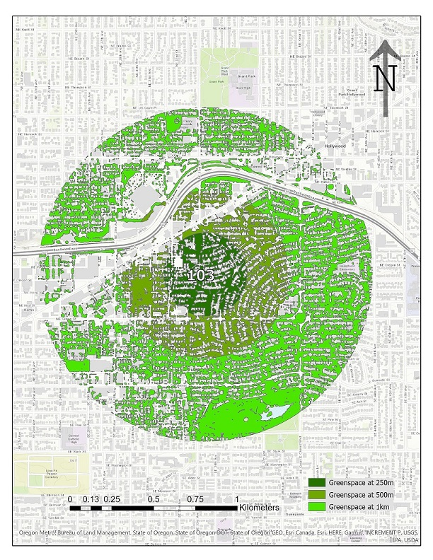

***
Geospatial Information Sciences provides insigtful tools to answer ecological and land-use questions. I have experience performing GIS analyses and map making in ESRI ArcPro, Python, and R. Below are selected projects I have worked on.

 

###Assessing bee richness in Westchester County, NY
Using R, I performed linear regression analysis to determine the landscape drivers of bee species richness in Westchester County, NY. The below map, made in R with Leaflet, displays sampling sites with markers scaled by bee richness to visialize these data. The orange is protected parkland. 

<iframe src="westchester_map.html" frameborder="0" width="100%" height="700px"></iframe>

 

###Investigating greenspace around Portland gardens

A similar current study in the Garden Ecology lab is investigating urban bee communities in Portland, OR. We want to know the drivers of the observed diversity and abundance at sampling sites, and needed to acquire landscape-level data that may influence bee communities. One of these is proportion of greenspace around these sites. Below is an example map I created in ESRI ArcPro of one of the sampling sites, with greenspace mapped at 250m, 500m, and 1km buffers.  

I created the below map in ESRI ArcOnline, displaying greenspace at 250m radii buffers.  

<iframe width="500" height="400" frameborder="0" scrolling="no" marginheight="0" marginwidth="0" title="Green Space Gardens" src="//osugisci.maps.arcgis.com/apps/Embed/index.html?webmap=e4acf669b44947939ca04ebe6f346f8d&extent=-122.9684,45.2953,-122.5887,45.6291&zoom=true&previewImage=false&scale=true&disable_scroll=true&theme=light"></iframe>

 

