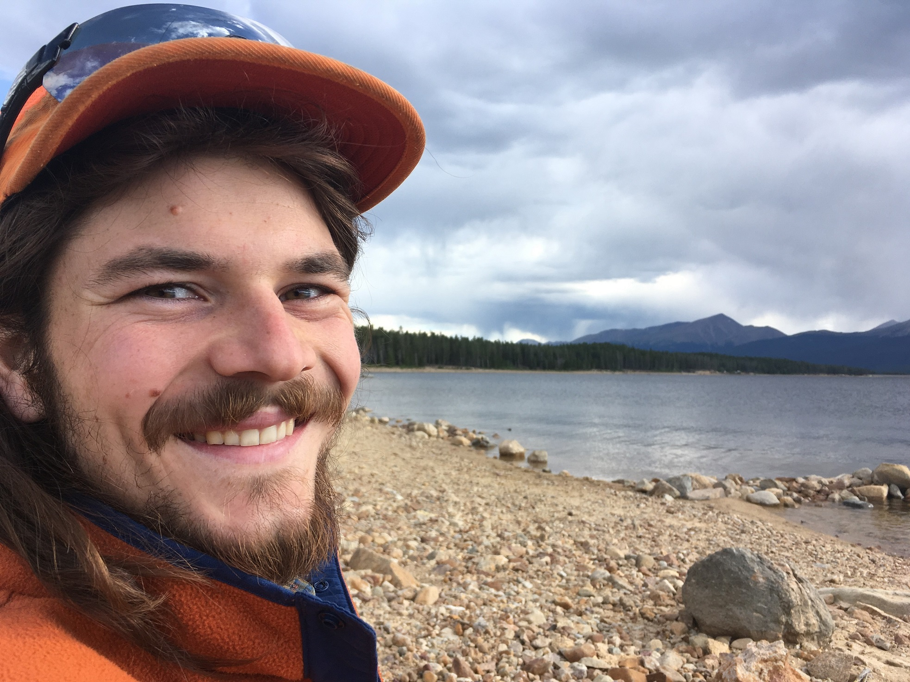

***

 

I am broadly interested how ecological function can be incorporated into urban and agricultural landscapes, particularly in creating habitat for sensitive species. In particular, I am intersted in pollinator conservation, native plants, geospatial information sciences, and protecting land from urban development.   

As a PhD Candidate at Oregon State University, I am studying the attractiveness of native wildflowers to pollinators and natural enemies, especially flowers with aesthetic value. This information has the potential to inform deliberate plantings that increase the habitat value of home gardens, urban parks, roadsides, and agricultural landscapes. This fits into my advisor Dr. Gail Langellotto's ongoing work in garden ecology. More information on our lab's on-goings can be found here:   http://blogs.oregonstate.edu/gardenecologylab/

 

 
 

